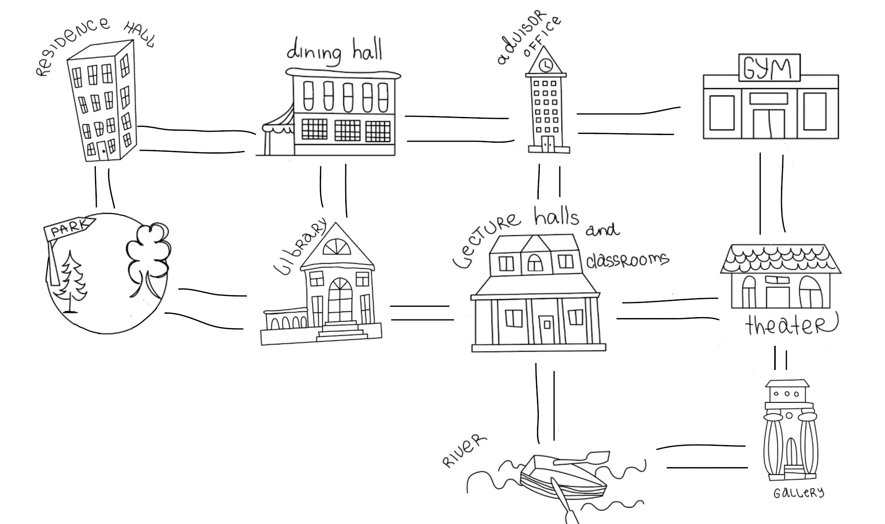

# Surviving in college
### Game Version 0.1
#### _Karina Syrota_
 
This is the game, which called "Surviving in college". The main goal of the user is similar to the name of the game - to survive in the college. In order to do so, the user must go through all the locations. 

Here is all 10 locations on the game map: 
- residence hall
- park
- library
- dining hall
- lecture halls and classrooms
- river
- advisor office
- theater
- gym
- gallery

